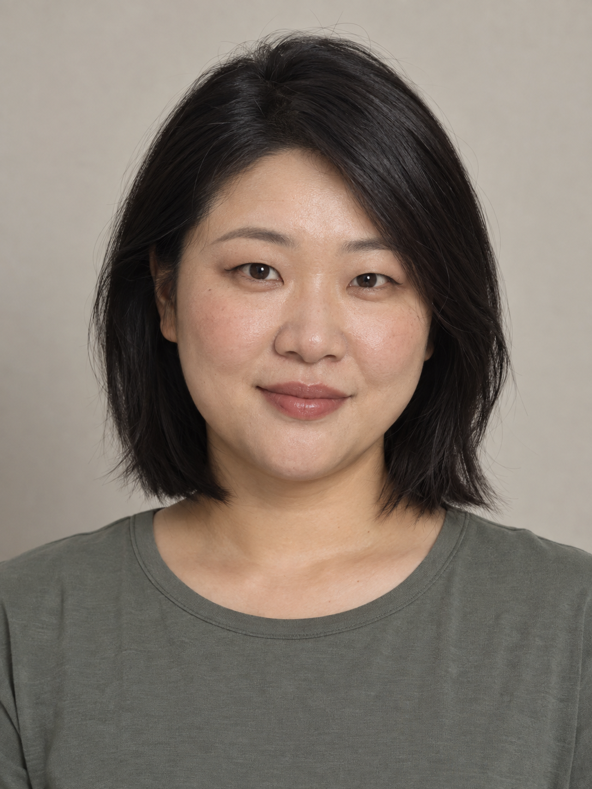
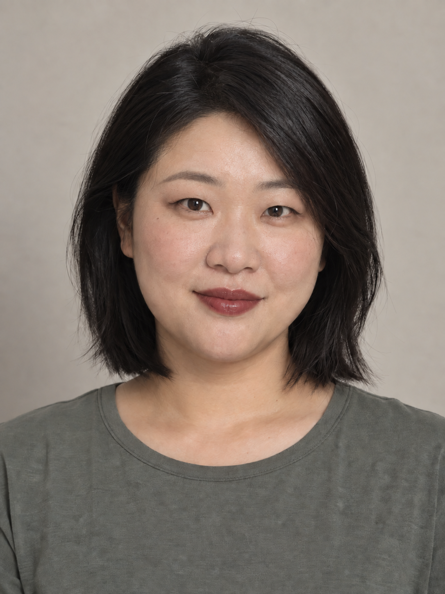

<p align="center"></p>

<h1 align="center">Portrait Forge</h1>

<p align="center">Turn character requirements into reusable plans and complete Chinese prompts. Change only the requested fields, with a recorded baseline and explicit differences.<br><em>人像工坊：角色档案、受控修改与完整中文提示词。</em></p>

<p align="center">Version <strong>1.0.0</strong> · Python <strong>3.9+</strong> · <a href="LICENSE">MIT</a> · No third-party Python dependencies</p>

<p align="center"><a href="README.md">简体中文</a> · <strong>English</strong></p>

<p align="center"><a href="#install">Install</a> · <a href="#examples">Existing examples</a> · <a href="#usage">Use</a> · <a href="#scope">Validation and sources</a></p>

<a id="examples"></a>

## Tested example: change only the lip color

On 2026-09-15, two actual calls created a baseline portrait of the existing fictional adult character `lin-01`, then edited the lip color using that actual image as the reference. These are the unmodified tool outputs.

| Baseline: muted pink-brown | Referenced edit: muted burgundy |
| --- | --- |
|  |  |

**The lip-color change worked; strict local preservation failed.** The overall appearance and composition remain similar, but skin, flyaway hair and fabric texture were regenerated. This is not exact identity or unchanged regions outside the lips. All 31 program tests passed; the image findings cover this one pair only.

[Test report and reproduction steps](examples/verified-20260915/REPORT.md#english-summary) · [Actual generation prompt](examples/verified-20260915/baseline-prompt.txt) · [Actual reference-edit prompt](examples/verified-20260915/edit-prompt.txt)

<details>
<summary>More existing text designs and runnable plans</summary>

The existing prompts and plans remain available below. The ensemble and reference-analysis cases have not been verified with real image outputs.

| Example | Readable result | Structured plan |
| --- | --- | --- |
| Original portrait `lin-01` | [Complete Chinese prompt](examples/compiled/01-original.md) | [Original plan](examples/01-original.json) |
| Change only lip color to muted burgundy | [Complete revised prompt](examples/compiled/02-edited.md) | [Revised plan](examples/02-edited.json) · [Patch](examples/lip-patch.json) |
| Five distinct faces with the same makeup | [Five complete prompts](examples/compiled/03-roster.md) | [Ensemble plan](examples/03-roster.json) |
| Reference observations and an incomplete baseline | [Example directory](examples/) | [Reference plan](examples/04-reference.json) · [Incomplete baseline](examples/05-partial-baseline.json) |

</details>

## What you can receive

| Task | Deliverable |
| --- | --- |
| Original character | A short direction and a complete Chinese prompt; a JSON plan when reuse is requested |
| Fixed character, new makeup, or a local edit | A complete revised prompt, recorded field changes, and baseline checks |
| Different faces with shared makeup, or an ensemble | A complete prompt per person, pairwise structural comparisons, and makeup checks |
| Reference analysis within a specified scope | Visible facts, inferences, and unknowns kept separate; only the requested scope recorded |

The host agent handles natural-language design. Python tools perform deterministic validation, revision, and compilation. No image model or API key is bundled. Image generation requires an explicit request and an available host tool. This skill is not intended for reverse-engineering product posters or producing complete video storyboards.

<a id="install"></a>

## Install

The repository is public. Clone the source directly, then run from the repository root:

```sh
git clone https://github.com/ai-pi-labs/portrait-forge.git
cd portrait-forge
python3 tools/install.py --dest "$HOME/.agents/skills"
```

The result is `~/.agents/skills/portrait-forge/SKILL.md`. The installer refuses to overwrite an existing target. Back up the previous version or choose another skills parent. You can also copy the complete `skill/portrait-forge/` directory manually; keep its resources and avoid adding an extra directory level.

<details>
<summary>Project scope, standalone ZIP, and other hosts</summary>

For a project, use `python3 tools/install.py --dest "/your/project/.agents/skills"`. The `portrait-forge/` directory in the standalone skill ZIP is the complete skill. In Codex, check the skill selector in a new conversation; restart if it does not appear.

ChatGPT environments with a skill selector can use their available selection mechanism. Do not assume every host supports `$` or one universal ZIP import flow. Existing host checks and limitations are documented in [HOSTS.md](docs/HOSTS.md). For conversations without native skill installation, export a reading pack:

```sh
python3 tools/export_work.py --out ../portrait-forge-work-pack
```

Attach `portrait-forge-knowledge.md` and use the instructions in `START-HERE.txt`. This loads conversation material; it is not a persistent installation. Without Python, apply the rules manually and state that programmatic validation was not run.

</details>

<a id="usage"></a>

## Use

```text
Use $portrait-forge to design an adult woman with a round face and monolids.
Keep a broad nasal bridge, with a reserved expression and soft facial volume.
```

The default output is a short direction and a complete Chinese prompt. No JSON form is required. Add “also save a JSON character plan” when you need a reusable record.

```text
Read this character plan. Change only the lip color to burgundy and preserve every other setting.
Design five adults with distinct faces and the same peach-pink makeup. Give each a complete prompt.
Analyze only the makeup in this image. Do not reuse the person's face; keep unclear details unknown.
```

For an image, explicitly request generation from the plan while preserving the locked fields. If no image tool is available, keep the usable prompt. A character plan is not a face-recognition model; actual images still need visual review.

<details>
<summary>Local commands: validate, compile, and revise</summary>

Run from the repository root. Commands produce JSON:

```sh
python3 skill/portrait-forge/scripts/portrait.py validate examples/03-roster.json
python3 skill/portrait-forge/scripts/portrait.py compile examples/01-original.json
python3 skill/portrait-forge/scripts/portrait.py revise examples/01-original.json examples/lip-patch.json --allow makeup.lip_color --request "只改唇色为酒红" > ../portrait-edited.json
python3 skill/portrait-forge/scripts/portrait.py compile ../portrait-edited.json --baseline examples/01-original.json
```

The revision request above means “change only the lip color to burgundy.” Write the result to a new file, never to the input path. Success returns 0, input or contract failure returns 1, and command usage errors return 2. Developers can run `python3 -m unittest discover -s tests -v`; this tests program contracts, not real images.

</details>

## Maintaining a plan

One field catalog drives validation, Chinese prompt compilation, and the derived JSON Schema. Compiled output includes trace data and a source hash. Face structure, skin tone, makeup, hair, and photography can be locked separately. Revisions use allowed field paths, baseline hashes, and actual differences. Unknown details remain unknown, and ensemble checks compare every pair.

[Complete skill](skill/portrait-forge/SKILL.md) · [Architecture](docs/ARCHITECTURE.md) · [Fields and host extensions](docs/EXTENDING.md) · [File inventory](manifest.json)

<a id="scope"></a>

## Validation and sources

On 2026-09-15, all 31 program tests were rerun, with isolated installation and one actual portrait/reference-edit pair. The edit has disclosed texture drift and does not prove strict identity or local pixel preservation. The 24 natural-language scenarios remain unrun evaluation materials, not a model pass rate. Online ChatGPT Work installation remains untested. See the [current test report](examples/verified-20260915/REPORT.md#english-summary), [historical validation records](docs/VALIDATION.md), and [behavior evaluation](evals/README.md).

This is an independent implementation informed by [nuyoah-ai-works/nuyoah-portrait-character-designer](https://github.com/nuyoah-ai-works/nuyoah-portrait-character-designer), including locking, separation of face and makeup, reference visibility, and ensemble checks. It does not bundle the original reference photos or the author's generated-image examples, or claim better automatic image results. See the [upstream review](docs/UPSTREAM_REVIEW.md).

The project uses the [MIT License](LICENSE) and retains attribution to **Portrait Forge contributors**. The reference project's **南鸢 nuyoah** attribution and MIT license remain in [THIRD_PARTY_NOTICES.md](THIRD_PARTY_NOTICES.md). AIπ branding does not change those rights or imply the original author's involvement or endorsement. Supporting documents and compiled examples are primarily in Chinese.
