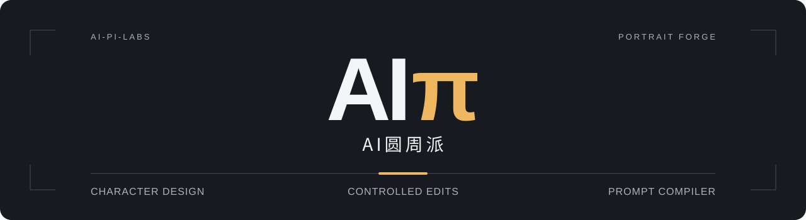

<p align="center"></p>

<h1 align="center">AIπ｜AI圆周派 · 人像工坊</h1>

<p align="center">把人物需求整理成可复用的角色档案与完整中文提示词。局部修改只动指定字段，保留基线与前后差异。<br><em>Portrait Forge — reusable character plans, controlled edits, and complete Chinese prompts.</em></p>

<p align="center">版本 <strong>1.0.0</strong> · Python <strong>3.9+</strong> · <a href="LICENSE">MIT</a> · 无第三方 Python 依赖</p>

<p align="center"><strong>简体中文</strong> · <a href="README.en.md">English</a></p>

<p align="center"><a href="#install">安装</a> · <a href="#examples">已有案例</a> · <a href="#usage">使用</a> · <a href="#scope">验证与来源</a></p>

## 能交付什么

| 任务 | 交付 |
| --- | --- |
| 原创角色 | 一句方向、完整中文 Prompt；需要复用时保存 JSON 档案 |
| 固定人物换妆、局部修改 | 完整新稿、字段变更记录与基线核对 |
| 同妆不同脸、角色阵容 | 每人完整提示词、所有配对的结构差异与同妆检查 |
| 限定范围参考图分析 | 区分可见信息、推测与未知；只记录用户指定范围 |

自然语言设计由宿主 Agent 完成，Python 工具负责确定性校验、修改和编译。本项目不附带图像模型或 API key；明确委托生图时，使用宿主实际可用的图片工具。它不用于产品海报反推或完整视频分镜。

<a id="examples"></a>

## 先看已有案例

以下是仓库已有的文字设计与可运行档案，未实际生成图片，不代表图片身份或美观效果已经验证。

| 案例 | 可读结果 | 结构档案 |
| --- | --- | --- |
| 原创人像 `lin-01` | [完整中文 Prompt](examples/compiled/01-original.md) | [原创档案](examples/01-original.json) |
| 只改唇色为低饱和酒红 | [完整修改稿](examples/compiled/02-edited.md) | [修改档案](examples/02-edited.json) · [局部补丁](examples/lip-patch.json) |
| 五人同妆、不同面部结构 | [五份完整 Prompt](examples/compiled/03-roster.md) | [阵容档案](examples/03-roster.json) |
| 参考分析与未知基线 | [示例目录](examples/) | [观察档案](examples/04-reference.json) · [未知基线](examples/05-partial-baseline.json) |

<a id="install"></a>

## 快速安装

使用有仓库访问权限的 GitHub 账号克隆源码，进入仓库根目录：

```sh
git clone https://github.com/ai-pi-labs/portrait-forge.git
cd portrait-forge
python3 tools/install.py --dest "$HOME/.agents/skills"
```

安装结果为 `~/.agents/skills/portrait-forge/SKILL.md`。已有同名目录时安装器拒绝覆盖；先备份旧版或选择另一技能父目录。也可手动复制完整的 `skill/portrait-forge/`，不要只复制 `SKILL.md` 或多套一层目录。

<details>
<summary>项目安装、独立 ZIP 与其他宿主</summary>

项目范围可运行 `python3 tools/install.py --dest "/你的项目/.agents/skills"`。独立 Skill ZIP 内的 `portrait-forge/` 就是完整技能目录。Codex 安装后在新会话中检查技能选择器，未出现时重启再检查。

支持技能选择器的 ChatGPT 环境可以按实际入口选择已安装技能，不能假定所有宿主都支持 `$` 或统一 ZIP 导入。现有账号和宿主核对范围见 [HOSTS.md](docs/HOSTS.md)。没有原生技能入口时，可导出会话资料：

```sh
python3 tools/export_work.py --out ../portrait-forge-work-pack
```

把 `portrait-forge-knowledge.md` 作为附件提供，再按 `START-HERE.txt` 开始任务。这是会话资料加载，不是永久安装；无 Python 时可按规则人工检查，但不能声称运行过脚本。

</details>

<a id="usage"></a>

## 使用

```text
使用 $portrait-forge，设计一位圆脸、单眼皮的成年女性，宽鼻背不改，清冷但保留圆润感。
```

默认交付一句方向和完整中文提示词，不要求先填 JSON。需要复用时加一句“同时保存角色档案 JSON”。

```text
读取这份角色档案，只把唇色换成酒红，保留其他全部设定。
用同一套桃粉妆设计五位不同脸的成年人，每人给完整提示词。
只分析这张图的妆容，不沿用人物的脸。看不清的地方保持未知。
```

需要图片时明确说“按刚才的方案生成图片，保留锁定项”。没有图片工具时保留可用 Prompt。角色档案不是人脸识别模型，图片一致性仍需查看实际结果。

<details>
<summary>本地试跑：校验、编译与局部修改</summary>

在仓库根目录执行，输出为 JSON：

```sh
python3 skill/portrait-forge/scripts/portrait.py validate examples/03-roster.json
python3 skill/portrait-forge/scripts/portrait.py compile examples/01-original.json
python3 skill/portrait-forge/scripts/portrait.py revise examples/01-original.json examples/lip-patch.json --allow makeup.lip_color --request "只改唇色为酒红" > ../portrait-edited.json
python3 skill/portrait-forge/scripts/portrait.py compile ../portrait-edited.json --baseline examples/01-original.json
```

修改稿使用新的文件路径，不能将输出重定向到输入文件。成功返回 0，输入或合同失败返回 1，用法错误返回 2。开发者可运行 `python3 -m unittest discover -s tests -v`；这验证程序合同，不验证真实图像。

</details>

## 档案为什么可维护

单一字段目录控制校验、中文编译与派生 Schema；编译输出带 trace 和源文件哈希。脸、骨相、肤色、妆、发型和摄影可分别锁定；局部修改通过路径白名单、基线哈希与实际差异复核。未知不自动填齐，阵容检查覆盖所有配对。

[完整技能](skill/portrait-forge/SKILL.md) · [架构](docs/ARCHITECTURE.md) · [扩展字段与宿主](docs/EXTENDING.md) · [文件清单](manifest.json)

<a id="scope"></a>

## 验证与来源

既有验证记录报告 31 项程序回归通过、独立目录安装与 ZIP 解压检查通过。24 条自然语言场景是待执行评估材料，不是模型通过率；尚未验证真实生图与图片身份效果，也未在线安装到 ChatGPT Work。本次首页整理不重新声明这些测试已经执行。详见[验证记录](docs/VALIDATION.md)与[行为评估](evals/README.md)。

项目独立编写，设计上参考 [nuyoah-ai-works/nuyoah-portrait-character-designer](https://github.com/nuyoah-ai-works/nuyoah-portrait-character-designer) 的锁定、脸妆分层、参考可见性和阵容核查思想；没有捆绑原参考照片或作者生图案例，也不声称自动生图效果优于原版。原仓库审查见 [UPSTREAM_REVIEW.md](docs/UPSTREAM_REVIEW.md)。

本项目采用 [MIT License](LICENSE)，保留 **Portrait Forge contributors** 署名；原参考项目的 **南鸢 nuyoah** 署名与 MIT 许可见 [THIRD_PARTY_NOTICES.md](THIRD_PARTY_NOTICES.md)。AIπ 品牌整理不改变原许可，也不暗示原作者参与或认可本项目。
